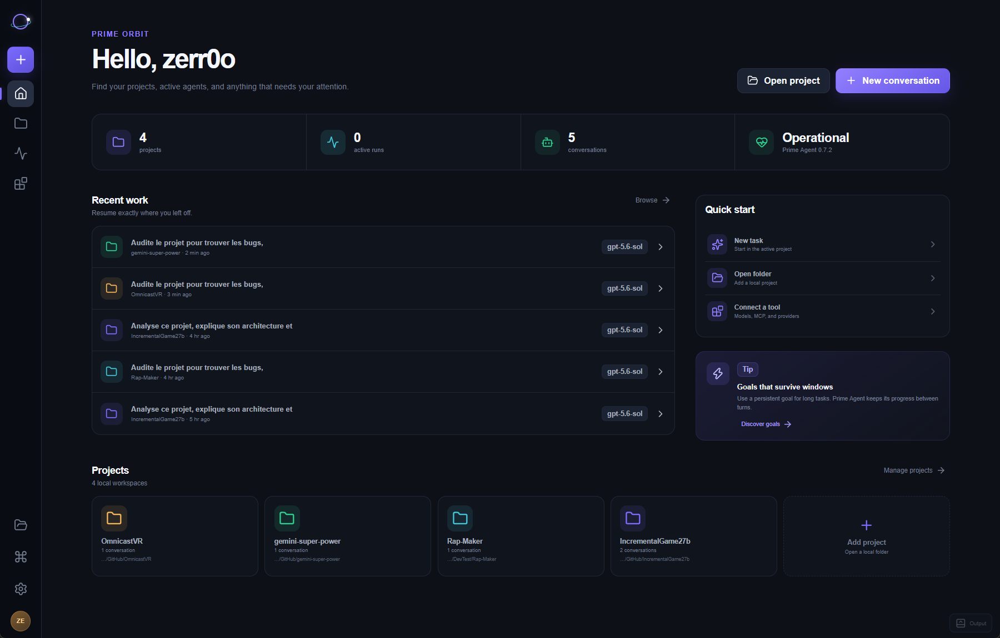
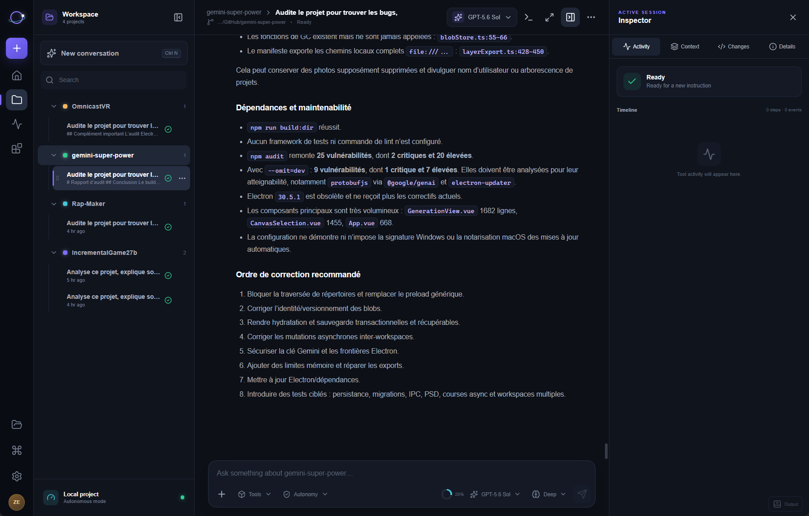
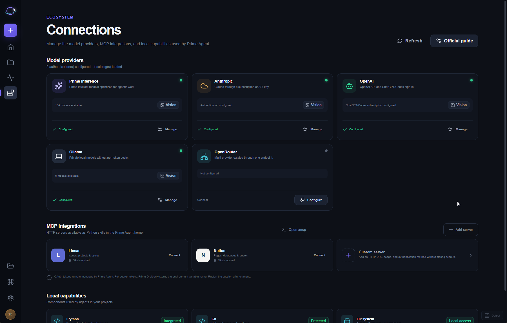

<div align="center">
  
  <h1>Prime Orbit</h1>
  <p><strong>A native project and conversation workspace for Prime Agent.</strong></p>
  <p>
    
    
    
    
  </p>
  <p>
    <a href="https://github.com/zerr0o/Prime-Orbit/releases/latest"><strong>Download the latest release</strong></a>
    ·
    <a href="#quick-start">Quick start</a>
    ·
    <a href="#development">Development</a>
  </p>
</div>



Prime Orbit turns [Prime Agent](https://github.com/PrimeIntellect-ai/prime-agent) into a focused desktop workspace. It combines projects, persistent conversations, streaming responses, tools, model configuration, MCP connections, background runs, and multi-window workflows in one interface.

> [!NOTE]
> Prime Orbit is an independent community client and is not an official Prime Intellect product.

## Highlights

- **Project-first workspace** — keep projects and their conversations visible together, reorder them manually with drag and drop, search globally, archive old work, and see which agents are running or finished.
- **Full Prime Agent conversations** — stream answers, attach images and local files, choose models and reasoning levels, run tools, inspect context, and review Git changes.
- **Useful activity instead of protocol noise** — tool calls and sub-agent activity are consolidated, repeated events are deduplicated, and large Python execution sequences can be grouped.
- **Fast, lazy startup** — Prime Orbit loads only the conversation you open. Other histories and agent processes are not eagerly restored.
- **Resilient history** — if the Prime Agent runtime is temporarily unavailable, the selected session can be reconstructed locally in read-only mode without duplicating the source transcript.
- **Long-running work** — agents can continue in the background, multiple windows share the same native runtime, and active sessions are released safely when no longer needed.
- **Providers and MCP** — inspect configured providers, manage HTTP MCP servers globally or per project, and use OAuth or bearer-token environment variables without exposing secret values to the renderer.
- **Desktop polish** — native file dialogs, custom context menus, keyboard navigation, light/dark/system themes, and complete English/French interface support.

## The workspace

Projects and conversations keep a stable, user-defined order. Expanding another project does not change the active conversation, while per-row status indicators make background work visible at a glance.



The conversation view separates the useful transcript from the execution timeline. Responses support Markdown, tool cards, grouped Python runs, session context, Git changes, and live agent state.

## Connections and MCP



Prime Orbit detects provider authentication metadata without reading secret values. Custom HTTP MCP servers can be configured globally or for one project, with atomic writes and automatic backups.

Prime Agent's interactive `/login`, `/logout`, and OAuth MCP flows still run in its official terminal. Prime Orbit opens the correct terminal workflow and refreshes the public connection state afterward.

## Quick start

### Windows installer

1. Download the `.exe` installer from the [latest GitHub release](https://github.com/zerr0o/Prime-Orbit/releases/latest).
2. Install and launch Prime Orbit.
3. Open an existing project folder.
4. Let the onboarding flow detect Prime Agent, or use **Quick install** to install it from the official repository.
5. Configure a provider, create a conversation, and start working.

The 0.1.9 desktop build is validated on Windows 10/11 x64. Microsoft Edge WebView2 is normally already present on supported Windows installations.

> [!IMPORTANT]
> The 0.1.9 installers are not code-signed yet. Windows SmartScreen may display an unknown-publisher warning. Verify the SHA-256 values in the release notes before running a downloaded installer.

### Prime Agent requirements

For an existing or managed Prime Agent installation, Prime Orbit checks for:

- Node.js 22.8 or newer;
- npm;
- Git;
- Bash (Git Bash is supported on Windows).

The managed installer clones only the official Prime Agent repository. It refuses an unexpected origin, an unsafe target path, or unrecognized local changes, and pins the runtime to an exact verified stable tag and commit.

## Core capabilities

| Area | Included |
| --- | --- |
| Projects | Multiple local workspaces, stable manual order, typed deletion confirmation, archive/pin/search, direct Explorer access |
| Conversations | Persistent Prime Agent sessions, lazy loading, streaming, follow-ups, models, reasoning, supervision profiles |
| Attachments | Images and validated local file references, native drag and drop, bounded file handling |
| Tools | Tool cards, Python grouping, sub-agent activity, command palette, execution inspector |
| Runtime | One native RPC process per conversation, multi-window leases, background work, graceful stop and recovery |
| Models | Provider catalogs, scoped model selection, validated `models.json`, atomic save and backup |
| MCP | Built-in and custom HTTP servers, global/project scope, OAuth or bearer environment variable configuration |
| Reliability | Revisioned state, three-way multi-window merge, atomic persistence, runtime health checks, session fallback |
| Interface | English/French, light/dark/system themes, accessible dismissible menus, custom context menu |

## Data, privacy, and safety

- Prime Orbit does not enable application telemetry.
- Conversation transcripts remain owned by Prime Agent and are loaded from its RPC/session storage. Prime Orbit persists project metadata, preferences, drafts, and session references—not a competing transcript database.
- Provider secrets are not returned to the webview. For bearer authentication, Prime Orbit stores only the environment variable name.
- Configuration and workspace-state writes are atomic and revisioned. Managed JSON files receive backups before replacement.
- On Windows, Prime Orbit can recover an exact stale Prime Agent session lease only after proving that its recorded process is no longer alive. Live or unverifiable locks are preserved.

> [!WARNING]
> Prime Agent is not a sandbox. Its tools run with the permissions of your user account. Prime Orbit's supervision profiles change the UI experience; they do not provide operating-system isolation.

## Troubleshooting

### Prime Agent is not detected

Open **Settings → Prime Agent** and select **Check again**. Prime Orbit validates the real launch command instead of trusting a file path. If a source checkout is incomplete, rebuild it or use the managed installation.

### A conversation cannot be restored

Prime Orbit first tries the native RPC session. When possible, it then displays the selected JSONL history locally in read-only mode and keeps the original diagnostic visible. Use **Retry loading** after repairing Prime Agent; do not delete the conversation file.

### `EPERM` while opening a session on Windows

Prime Agent versions affected by the Windows directory-rename behavior can leave a stale session lease after an interrupted process. Prime Orbit 0.1.8 and later safely quarantine only the exact stale lease after verifying its owner identity, then retry the normal RPC launch. Version 0.1.9 also normalizes the upstream Windows lease collision inside managed daemon workers.

### Authentication or MCP OAuth is required

Use **Connections → Manage/Configure** to open the official Prime Agent terminal flow. Complete `/login` or `/mcp login <name>`, then refresh connections and restart the active session when prompted.

## Architecture

```text
React + TypeScript webview
        │ typed Tauri commands and events
        ▼
Rust desktop backend
  ├─ project and revisioned UI-state persistence
  ├─ validated files, models, MCP, Git and diagnostics
  ├─ Prime Agent process broker and multi-window leases
  └─ session recovery and read-only history fallback
        │ JSON-RPC over stdio
        ▼
Prime Agent
```

The renderer never launches child processes directly. The Rust backend validates paths and inputs, owns each Prime Agent RPC process, fans events out to interested windows, and keeps runtime-only messages out of durable UI state.

## Development

### Prerequisites

- Node.js 22.8+
- npm
- Rust stable
- [Tauri 2 system dependencies](https://v2.tauri.app/start/prerequisites/)
- Git and Bash for the managed Prime Agent installation flow

### Run locally

```powershell
npm install
npm run desktop:dev
```

### Validation

```powershell
npm run test:unit
npm run check
cargo test --manifest-path src-tauri/Cargo.toml
cargo clippy --manifest-path src-tauri/Cargo.toml --all-targets -- -D warnings
```

### Build installers

```powershell
npm run desktop:build
```

Tauri writes platform bundles under `src-tauri/target/release/bundle/`.

## Release status

Prime Orbit is an early desktop release. Version 0.1.9 ships Windows x64 NSIS and MSI installers. macOS and Linux code paths exist, but official binaries have not yet been validated or published.

See [CHANGELOG.md](CHANGELOG.md) for release details.

## Contributing and security

Read [CONTRIBUTING.md](CONTRIBUTING.md) before proposing a change. Please report vulnerabilities through GitHub's private vulnerability-reporting flow as described in [SECURITY.md](SECURITY.md), never in a public issue.

## License

Prime Orbit is available under the [MIT License](LICENSE). Prime Agent is a separate project distributed under its own license and terms.
